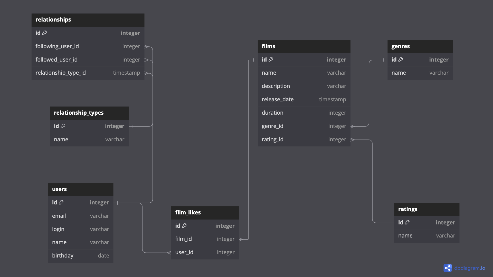

# java-filmorate
Template repository for Filmorate project.



Исходник диаграммы (https://dbdiagram.io):

[filmorate-erd.txt](db_diagram/filmorate-erd.txt)

Получить все фильмы:

```sql
SELECT f.name,
       g.name,
       r.name
FROM film AS f
INNER JOIN genre AS g ON g.id=f.genre_id
INNER JOIN rating AS r ON r.id=f.ratin_id;
```

10 самых популярных фильмов:

```sql
SELECT f.name film_name,
       COUNT(*) count
FROM film AS f
LEFT JOIN film_like AS fl ON fl.film_id=f.id
GROUP BY film_name
ORDER BY count DESC
LIMIT 10;
```
